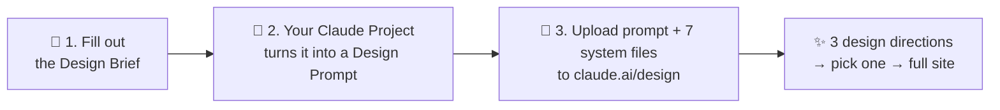

# Design Scarlet Macaw 🦜

**A complete design system for [Claude Design](https://claude.ai/design): fill out one brief, upload one small set of files, and get an agency-grade website — not generic AI output.**



## What this is

Claude Design (claude.ai/design) can build beautiful websites — but out of the box it drifts toward the same generic "AI look": the same fonts, the same purple gradients, the same layouts. This repo is a rulebook + pipeline that constrains it: 23 design rules, a banned-defaults list with exact hexes, conversion patterns backed by evidence, per-industry playbooks, and a synthesizer that turns a plain-English brief into a build-ready prompt.

**What you get out:** 3 distinct design directions, a full style guide, every page you asked for, and a developer handoff document — with a per-page compliance audit before anything ships.

## Before you start

- A **claude.ai account** with access to **Projects** and **Claude Design** (paid plan)
- **~20 minutes** for one-time setup ([SETUP.md](SETUP.md)) — including dropping one `CLAUDE.md` into your Claude Design project, which then applies to every build automatically
- Any OS. (Mac users get a bonus double-click kit script; everyone else uses the Python script or a plain file list.)

## How it works — 3 steps

### 1. Fill out the brief
Open [01-DESIGN-BRIEF-TEMPLATE.md](01-DESIGN-BRIEF-TEMPLATE.md) and answer the questions about the business — yours or a client's. Skip anything you don't know; the system has smart defaults and will tell you what's missing.

### 2. Turn it into a build prompt
Paste the filled brief into your Claude Project (one-time setup in [SETUP.md](SETUP.md)). It runs the Synthesizer and hands back two files: a **Design Prompt** (for Claude Design) and a **Dev Handoff** (for whoever ships the site — skip it if that's just you).

### 3. Upload to claude.ai/design
Upload your **Design Prompt + the 7 system files** (= 8 uploads total, listed below) to claude.ai/design — **always as file attachments, never pasted**. Claude Design builds 3 directions; pick your favorite (or mix and match), and it builds every page in your brief.

The 7 system files that ride along with every build:

```
02-MASTER-PLAYBOOK.md
03-COMPONENT-LIBRARY.md
04-CONVERSION-PLAYBOOK.md
CRAFT-RULES.md
SECTION-LAYOUT-LIBRARY.md
OPERATING-LOG.md
industries/<the ONE matching industry file>
```

Mac shortcut: double-click `New Client Kit.command` and it assembles this folder for you. Everyone else: `python3 new-client-kit.py`, or just grab the files above by hand.

## ⛔ The one rule that matters

**Never PASTE a system file into a chat — always ATTACH it as a file.**
Pasting long files silently truncates them; an early version of this system lost its last three rules that way and nobody noticed for weeks. Files are read in full. Pastes are not.

## What's in this repo

**You read these:**

| File | What it is |
|---|---|
| [README.md](README.md) | This file — start here |
| [SETUP.md](SETUP.md) | One-time setup (~20 min) |
| [00-HOW-THIS-WORKS.md](00-HOW-THIS-WORKS.md) | The full 7-stage workflow, in detail |
| [01-DESIGN-BRIEF-TEMPLATE.md](01-DESIGN-BRIEF-TEMPLATE.md) | The brief you fill out per project |

**Claude reads these — you just upload them:**

| File | What it is |
|---|---|
| [02-MASTER-PLAYBOOK.md](02-MASTER-PLAYBOOK.md) | The constitution — Rules 1–23, Motion Contract, Compliance Audit |
| [CRAFT-RULES.md](CRAFT-RULES.md) | Anti-"AI-slop" layer — banned defaults, typography/color craft, WCAG 2.2 floors |
| [03-COMPONENT-LIBRARY.md](03-COMPONENT-LIBRARY.md) | Every page section, specced |
| [04-CONVERSION-PLAYBOOK.md](04-CONVERSION-PLAYBOOK.md) | Conversion patterns + evidence standards |
| [SECTION-LAYOUT-LIBRARY.md](SECTION-LAYOUT-LIBRARY.md) | Layout vocabulary + page rhythm rules |
| [OPERATING-LOG.md](OPERATING-LOG.md) | Cross-project lessons the builder must consult |
| [05-PROMPT-SYNTHESIZER.md](05-PROMPT-SYNTHESIZER.md) | The brief → prompt engine (lives in your Claude Project) |
| [claude-design-project/CLAUDE.md](claude-design-project/CLAUDE.md) | The persistent build layer — sits at your **Claude Design project root**, applies to every chat there |
| `industries/` | Per-industry playbooks (healthcare, legal, real estate, industrial, general) |

**Reference & optional:**

| File | What it is |
|---|---|
| [DEV-HANDOFF-TEMPLATE.md](DEV-HANDOFF-TEMPLATE.md) | Developer handoff base (agency workflow) |
| [POST-LAUNCH-PLAYBOOK.md](POST-LAUNCH-PLAYBOOK.md) | Post-launch analytics + hypothesis loop |
| [DESIGN-RATIONALE.md](DESIGN-RATIONALE.md) / [CLIENT-PRESENTATION.md](CLIENT-PRESENTATION.md) | Stakeholder/client-facing write-up templates |
| [tokens.css](tokens.css) / [brand-style-guide-template.html](brand-style-guide-template.html) | Builder-side references (never uploaded) |
| [docs/](docs/) | System history, advanced Claude Design features, upload list |

## Level up (optional, recommended)

Claude Design now supports **native Design Systems** — you can publish this system's craft layer directly into the platform so it's enforced on every project automatically. See [docs/CLAUDE-DESIGN-NATIVE.md](docs/CLAUDE-DESIGN-NATIVE.md) for that, plus `/design-sync` dev handoff and token-saving tips.

## FAQ

- **"It asked me questions instead of building."** A required file didn't upload — recheck the 8-file list in step 3.
- **"The .command file won't open on my Mac."** Downloaded ZIPs get quarantined: right-click → Open (once), or run `python3 new-client-kit.py` instead.
- **"I'm building for my own business, not a client."** You're the client — fill the brief about yourself and ignore the Dev Handoff / client-presentation steps.
- **"Do I really just attach 8 markdown files?"** Yes. That's the whole trick — attached files are read in full and steer the build.

## License & credits

MIT — free for anyone to use, fork, and adapt. Built by [bravoandrei498-pixel](https://github.com/bravoandrei498-pixel). System history and provenance: [docs/HISTORY.md](docs/HISTORY.md).
